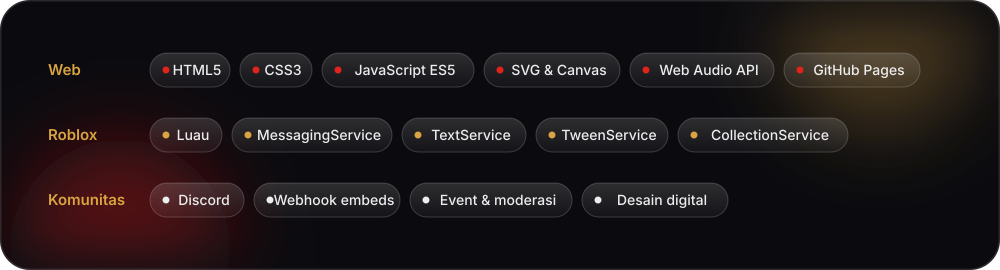
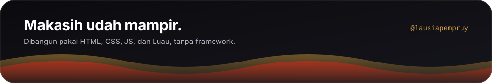

  

  <a href="#tentang">Tentang</a> &nbsp;·&nbsp;
  <a href="#proyek">Proyek</a> &nbsp;·&nbsp;
  <a href="#sistem-roblox">Sistem Roblox</a> &nbsp;·&nbsp;
  <a href="#stack">Stack</a> &nbsp;·&nbsp;
  <a href="#statistik">Statistik</a> &nbsp;·&nbsp;
  <a href="#kontak">Kontak</a>

## Tentang

Halo, gue **Bahlil**. Gue bikin web, nulis sistem Roblox, dan ngurus komunitas. Biasanya tiga-tiganya jalan bareng, karena komunitas butuh tempat (web) dan tempat itu butuh isi (game).

- Web gue murni **vanilla HTML, CSS, dan ES5**, dihost di GitHub Pages, tanpa framework.
- Di sisi Roblox gue nulis **Luau** buat sistem yang beneran kepake: chat lintas server, dashboard bencana, sampai cuaca.
- Soal visual, gue pegang satu aturan: efek harus punya alasan. Kaca dipakai di tempat yang butuh kedalaman, bukan ditempel di mana-mana.

## Proyek

  
  
  

<b>Proyek lainnya</b> (klik buat buka)

 

| Proyek | Isinya |
| :-- | :-- |
| [**Staff Familia Editor**](https://github.com/balaiyasajerasi/Staff-Familia-Editor) | Editor bagan hierarki staff ala Canva/Figma. Kartu bisa digeser, diskala, diputar, ada undo/redo 60 langkah dan 3 tema. |
| **WalletKu** | Aplikasi pencatat keuangan pribadi. Enkripsi AES-GCM dengan PIN, dompet tanpa batas, recap animasi ala Spotify. |
| **VeaCode 2.0** | Code playground multi-file bergaya glassmorphism, dengan akun lokal dan hash PIN SHA-256. |
| **IVH Digital Book** | Buku sejarah interaktif "Ilmu Sejarah VOC". |
| **Gerald's Private Web** | Website personal dengan nuansa iOS 26 Liquid Glass. |

## Sistem Roblox

Sisi Luau gue, dari yang paling berat ke yang paling ringan:

| Sistem | Isinya |
| :-- | :-- |
| **ITCP Communication System V3** | Chat lintas server, 13 file. DM lewat MessagingService, filter lewat TextService, dan feature flags. |
| **Disaster Dashboard** | 10 jenis bencana, titik shelter lewat tag CollectionService, notifikasi ala iPhone. |
| **Weather System** | Cuaca ala El Reno 2013 lengkap dengan petir, tornado, dan efek angin. |
| **Certification Countdown GUI** | Hitung mundur dengan animasi TweenService. |
| **Murrotal Audio Setup** | Audio dengan reverb dan echo biar terasa seperti akustik masjid. |

## Stack

  

## Statistik

  
  

  

<b>Grafik aktivitas</b> (klik buat buka)

 

  

  <picture>
    <source media="(prefers-color-scheme: dark)" srcset="https://raw.githubusercontent.com/lausiapempruy/lausiapempruy/output/github-snake-dark.svg">
    <source media="(prefers-color-scheme: light)" srcset="https://raw.githubusercontent.com/lausiapempruy/lausiapempruy/output/github-snake.svg">
    
  </picture>

## Kontak

Mau kolab, nanya soal proyek, atau sekadar ngobrol soal web dan Roblox? Mampir aja.

  
  
  

